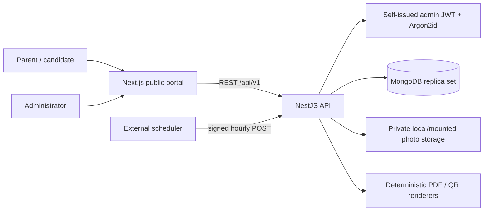
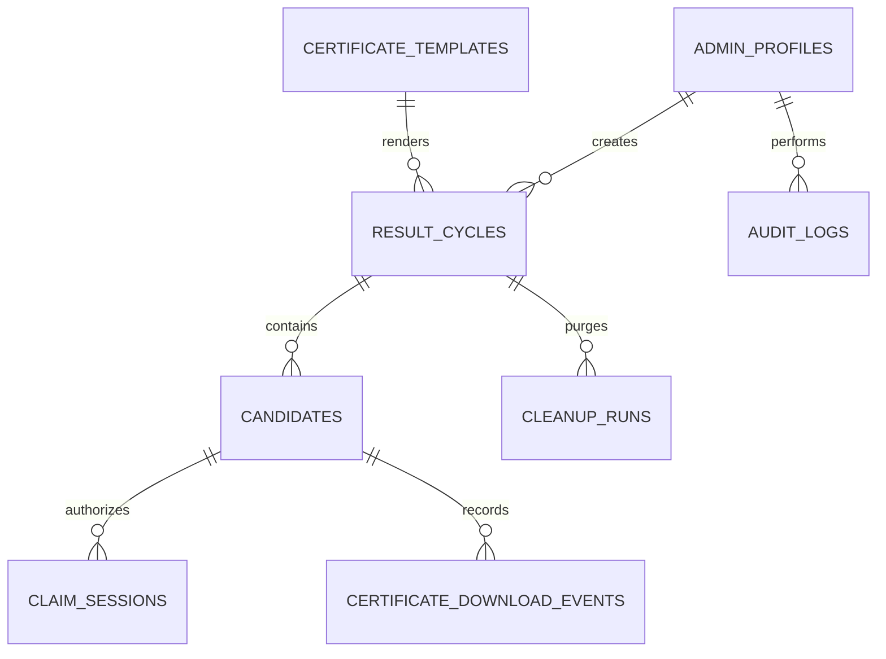
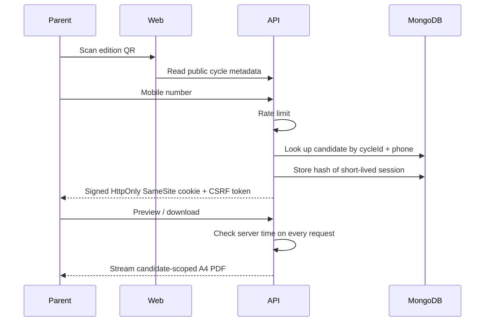
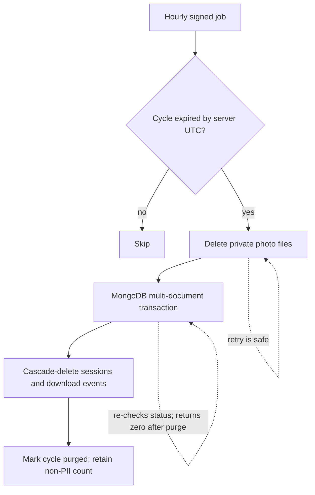

# Architecture and operational flows

## Entity relationship overview

Each box is a MongoDB collection rather than a SQL table; `CANDIDATES` documents are looked up directly by `cycleId` + `phone` (a unique compound index), so there is no separate credentials collection.

## Claim request flow

## Deletion and retry flow

Photo deletion happens before the database transaction. Removing already-missing private files is retry-safe. The transaction re-reads the cycle's status before mutating anything, so a retry after a failed transaction is safe and a repeat call after a successful purge is a no-op. PDFs are streamed on demand, so there is no certificate cache to purge.
