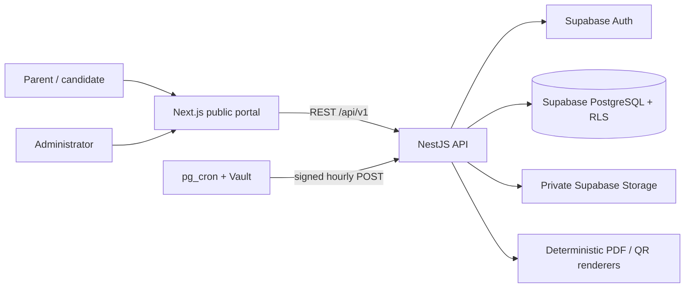
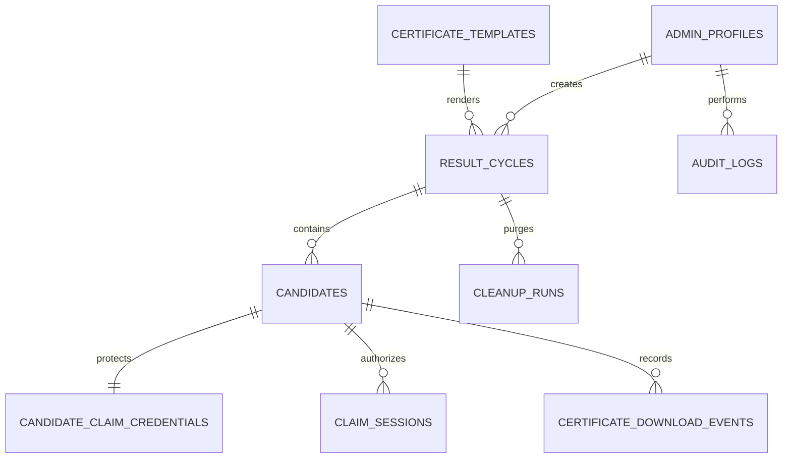
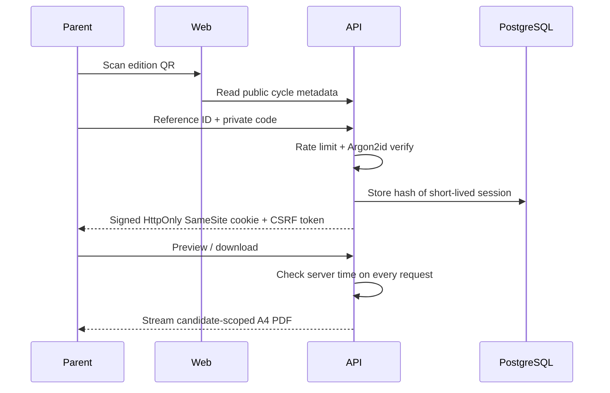
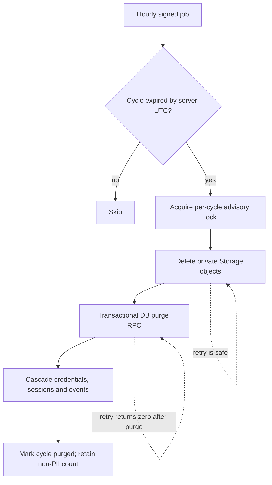

# Architecture and operational flows

## Entity relationship overview

## Claim request flow

## Deletion and retry flow

Storage deletion happens before the database transaction. Removing already-missing private objects is retry-safe. If the DB transaction fails, a retry finishes the purge. PDFs are streamed on demand, so there is no certificate cache to purge.
